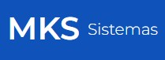
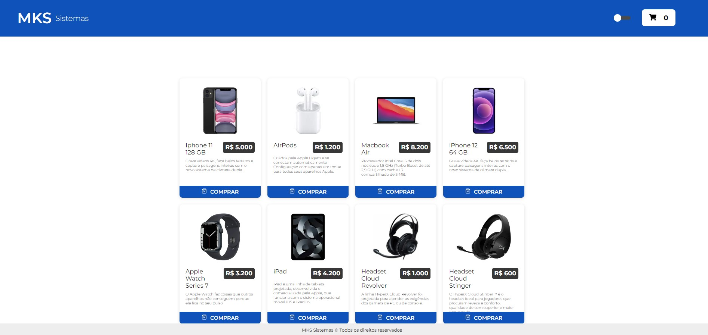
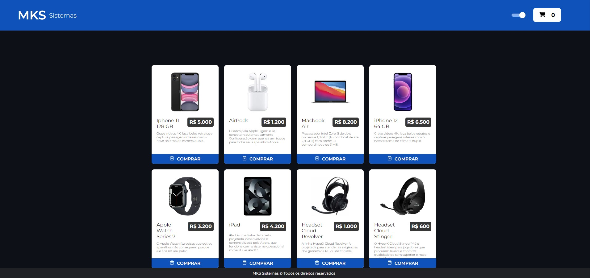
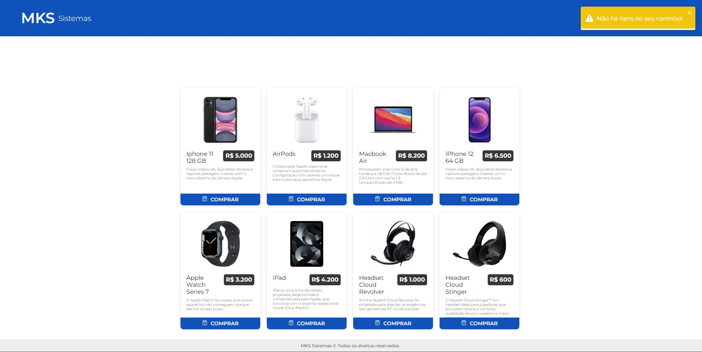
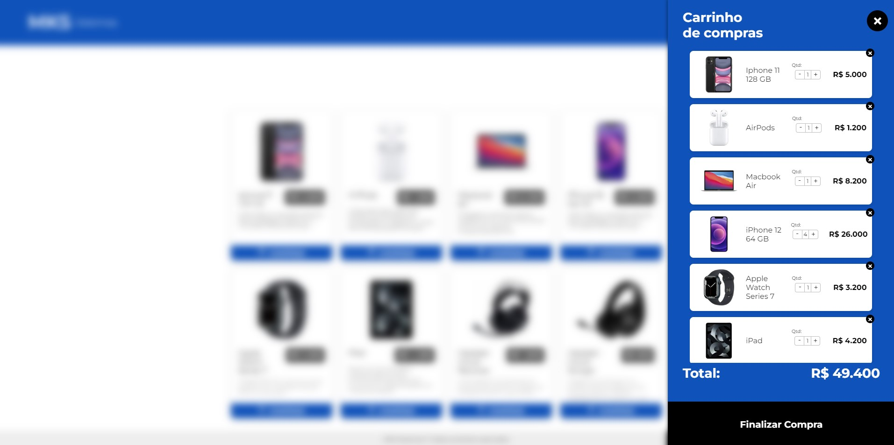
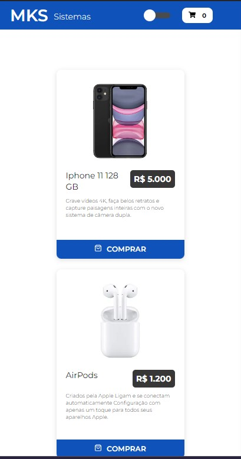
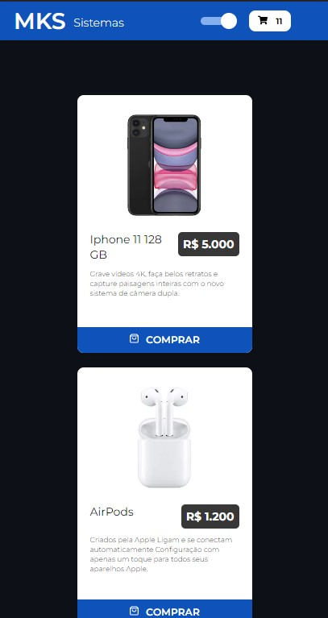
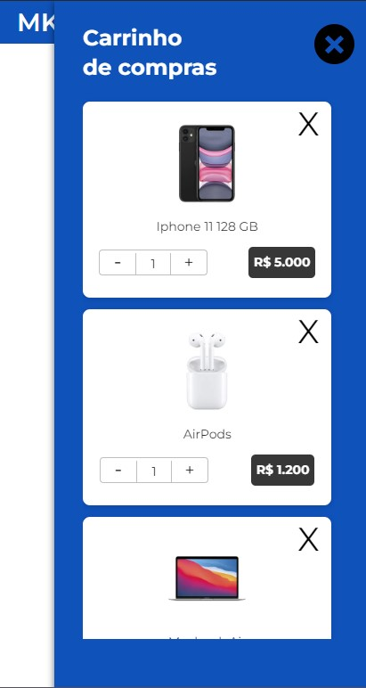
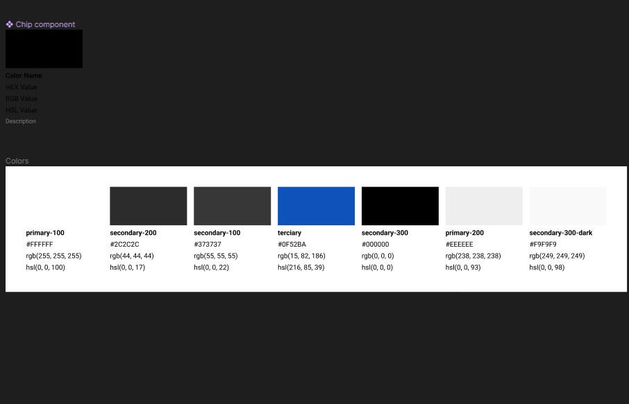

<p align="center">  MKS Sistemas 🚀</p>

<p align="center">
   
</p>

<p align="center">	
   <a href="https://www.linkedin.com/in/lorison-gilles/">
      
   </a>
  

  <a href="https://github.com/Gilles30/ms-store/commits/master">
    
  </a> 
  
  <a href="https://github.com/Gilles30/ms-store/stargazers">
    
  </a>
</p>

> <p align="center"> :rocket: Projeto criado para teste de competência. </p>

<p align="center">
    <a href="README.md">English</a>
    ·
    <a href="README-pt.md">Portuguese</a>
 </p>

<div align="center">
  <sub>O E-commerce de produtos MKS. Construído com ❤︎ por
    <a href="https://github.com/Gilles30">Lorison Gilles</a> and
    <a href="https://github.com/Gilles30/ms-store/">
      contributors
    </a>
  </sub>
</div>

# :pushpin: Indice

- [:pushpin: Indice](#pushpin-indice)
    - [Captura de tela da Web e itens fora do escopo](#captura-de-tela-da-web-e-itens-fora-do-escopo)
    - [Prints Mobile](#prints-mobile)
- [:eyes: Demo Website](#eyes-demo-website)
- [:computer: Tecnologias](#computer-tecnologias)
- [:rocket: Features](#rocket-features)
- [:rocket: Figma atualizado / StyleGuide](#rocket-figma-atualizado--styleguide)
- [:construction_worker: Como rodar](#construction_worker-como-rodar)
    - [📦 Rodar API](#-rodar-api)
    - [💻 Rodar Projeto Web](#-rodar-projeto-web)
- [:bug: Issues](#bug-issues)
- [:tada: Contribuindo](#tada-contribuindo)
  - [🤝 Contribuindo](#-contribuindo)
- [:closed_book: Licenca](#closed_book-licenca)

</p>

</br></br>

### Captura de tela da Web e itens fora do escopo

</br>

<div align="center">
   
   <p>
    Uma página do produto, onde podemos ver o número de itens no carrinho.
     Conseguimos adicionar mais itens ao carrinho clicando no sinal de mais e reduzindo os itens clicando no menos.
   </p>
   </br></br>
   
   </br></br>
   <p>
    Eu criei um modo escuro acionado por um interruptor no cabeçalho
   </p>
   </br></br>
   
   <p>
    Criei uma validação, quando não há itens selecionados no carrinho, ao clicar no ícone do carrinho para abri-lo, aparece um brinde com uma notificação
   </p>
   </br></br>
   
   <p>
    Criei um efeito de desfoque ao abrir o carrinho, deixando os itens da lista um pouco embaçados
   </p>
   
</div>
</br>

### Prints Mobile

<div align="center">
  
  </br></br>
   
   </br></br>
   
</div>

# :eyes: Demo Website

Você pode acessar o site em:
👉 demo:

[](https://ms-store-three.vercel.app/)

# :computer: Tecnologias

Este projeto foi feito utilizando as seguintes tecnologias:

- [Typescript](https://www.typescriptlang.org/)
- [NextJs](https://nextjs.org/)
- [Axios](https://axios-http.com/)
- [Prettier](https://prettier.io/)
- [React](https://reactjs.org/)
- [Styled-Components](https://www.styled-components.com/)
- [React-Switch](https://github.com/markusenglund/react-switch#readme)
- [React-Icons](https://react-icons.github.io/react-icons/)
- [React-Tostfy](https://fkhadra.github.io/react-toastify/introduction)
- [Jest](https://jestjs.io/)
- [Redux](https://redux.js.org/)
- [Babel](https://babeljs.io/)

# :rocket: Features

- Listagem de produtos.
- Seleção de itens para carrinho.
- Layout responsivo.

# :rocket: Figma atualizado / StyleGuide

<div align="center">
  
  </br></br>
</div>
  https://www.figma.com/file/gnbWP5GvE1a3rT9hkqMB6N/MKS-Front-end-challenge-(Copy)?node-id=5%3A207

# :construction_worker: Como rodar

```bash
# Clone Repository
$ git clone https://github.com/Gilles30/
ms-store.git
```

### 📦 Rodar API

- API consumed directly from the cloud!

```bash
# Routes and Endpoint
$ mks-frontend-challenge-api.herokuapp.com/

# Object Typing
$ Product {
    id	integer -> example: 1
    name	string -> example: iPhone X 128 GB
    brand	string -> example: Apple
    description	string -> example: O Apple iPhone X é um smartphone iOS avançado e abrangente em todos os pontos de vista com algumas características excelentes
    price	number -> example: 2000.1
  }
```

Acesse a API de documentos em mks-frontend-challenge-api.herokuapp.com/api-docs/

### 💻 Rodar Projeto Web

```bash
# Go to web folder
$ cd 
ms-store

# Install Dependencies (Only if you haven't installed the dependencies before)
$ yarn

# Run Aplication
$ yarn dev

```

Go to http://localhost:3000

# :bug: Issues

Fique à vontade para **arquivar uma nova edição** com o respectivo título e descrição no repositório [MKS](https://github.com/Gilles30/
ms-store/issues) repositório. Se você já encontrou uma solução para o seu problema, **eu adoraria analisar sua solicitação de pull**!

# :tada: Contribuindo

Confira a [contributing](./CONTRIBUTING.md) página para ver os melhores lugares para arquivar problemas, iniciar discussões e começar a contribuir.

## 🤝 Contribuindo

Siga os passos abaixo para contribuir:

1.  _fork_ o projeto (<https://github.com/Gilles30/
ms-store>)

2.  Faça um clone com _fork_ para sua máquina (`git clone https://github.com/Gilles30/
ms-store.git`)

3.  Crie um _branch_ para realizar sua modificação (`git checkout -b feature/name_new_feature`)

4.  Adicione suas modificações e faça o _commit_ (`git commit -m "Descreva sua modificação"`)

5.  _Push_ (`git push origin feature/name_new_feature`)

6.  Crie uma nova _Pull Request_

7.  Ok, agora é só esperar a análise 🚀

# :closed_book: Licenca

Lançado em 2022 :closed_book: License

Feito com amor [Lorison Gilles](https://github.com/Gilles30) 🚀.
Este projeto está sob a [MIT license](./LICENSE).

Dê um ⭐️ se esse projeto te ajudou!
