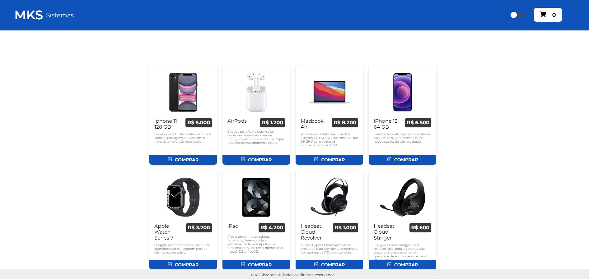
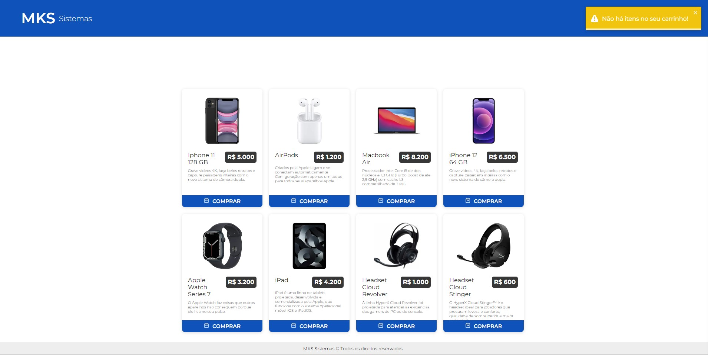
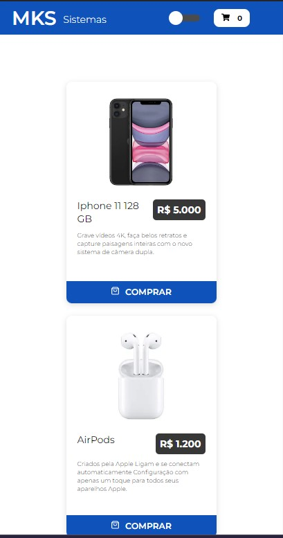
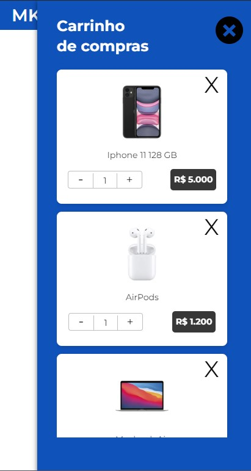

<p align="center">  MKS Sistemas 🚀</p>

<p align="center">
   
</p>

<p align="center">	
   <a href="https://www.linkedin.com/in/lorison-gilles/">
      
   </a>
  

  <a href="https://github.com/Gilles30/ms-store/commits/master">
    
  </a> 
  
  <a href="https://github.com/Gilles30/ms-store/stargazers">
    
  </a>
</p>

> <p align="center"> :rocket: Project created for competency test. </p>

<p align="center">
    <a href="README.md">English</a>
    ·
    <a href="README-pt.md">Portuguese</a>
 </p>

<div align="center">
  <sub>The Products MKS System. Built with ❤︎ by
    <a href="https://github.com/Gilles30">Lorison Gilles</a> and
    <a href="https://github.com/Gilles30/ms-store/">
      contributors
    </a>
  </sub>
</div>

# :pushpin: Table of Contents

- [:pushpin: Table of Contents](#pushpin-table-of-contents)
    - [Web Screenshot and out of scope items](#web-screenshot-and-out-of-scope-items)
    - [Mobile Screenshot](#mobile-screenshot)
- [:eyes: Demo Website](#eyes-demo-website)
- [:computer: Technologies](#computer-technologies)
- [:rocket: Features](#rocket-features)
- [:rocket: Figma updated / StyleGuide](#rocket-figma-updated--styleguide)
- [:construction_worker: How to run](#construction_worker-how-to-run)
    - [📦 Run API](#-run-api)
    - [💻 Run Web Project](#-run-web-project)
- [:bug: Issues](#bug-issues)
- [:tada: Contributing](#tada-contributing)
  - [🤝 Contributing](#-contributing)
- [:closed_book: License](#closed_book-license)

</p>

</br></br>

### Web Screenshot and out of scope items

</br>

<div align="center">
   
   <p>
    A product page, where we can see the number of items in the  cart.
    We were able to add more items to the cart by clicking on the plus and reducing the items by clicking on the minus.
   </p>
   </br></br>
   
   </br></br>
   <p>
    I created a dark mode triggered by a switch in the Header
   </p>
   </br></br>
   
   <p>
    I created a validation, when there are no items selected in the cart, when clicking on the cart icon to open it, a toast appears with a notification
   </p>
   </br></br>
   
   <p>
    I created a blur effect when opening the cart, making the list items a little blurry
   </p>
   
</div>
</br>

### Mobile Screenshot

<div align="center">
  
  </br></br>
   
   </br></br>
   
</div>

# :eyes: Demo Website

You can acess the website at:  
👉 demo:

[](https://ms-store-three.vercel.app/)

# :computer: Technologies

This project was made using the follow technologies:

- [Typescript](https://www.typescriptlang.org/)
- [NextJs](https://nextjs.org/)
- [Axios](https://axios-http.com/)
- [Prettier](https://prettier.io/)
- [React](https://reactjs.org/)
- [Styled-Components](https://www.styled-components.com/)
- [React-Switch](https://github.com/markusenglund/react-switch#readme)
- [React-Icons](https://react-icons.github.io/react-icons/)
- [React-Tostfy](https://fkhadra.github.io/react-toastify/introduction)
- [Jest](https://jestjs.io/)
- [Redux](https://redux.js.org/)
- [Babel](https://babeljs.io/)

# :rocket: Features

- Product listing.
- Item selection for cart.
- Responsive layout.

# :rocket: Figma updated / StyleGuide

<div align="center">
  
  </br></br>
</div>
  https://www.figma.com/file/gnbWP5GvE1a3rT9hkqMB6N/MKS-Front-end-challenge-(Copy)?node-id=5%3A207

# :construction_worker: How to run

```bash
# Clone Repository
$ git clone https://github.com/Gilles30/
ms-store.git
```

### 📦 Run API

- API consumed directly from the cloud!

```bash
# Routes and Endpoint
$ mks-frontend-challenge-api.herokuapp.com/

# Object Typing
$ Product {
    id	integer -> example: 1
    name	string -> example: iPhone X 128 GB
    brand	string -> example: Apple
    description	string -> example: O Apple iPhone X é um smartphone iOS avançado e abrangente em todos os pontos de vista com algumas características excelentes
    price	number -> example: 2000.1
  }
```

Access docs API at mks-frontend-challenge-api.herokuapp.com/api-docs/

### 💻 Run Web Project

```bash
# Go to web folder
$ cd 
ms-store

# Install Dependencies (Only if you haven't installed the dependencies before)
$ yarn

# Run Aplication
$ yarn dev

```

Go to http://localhost:3000

# :bug: Issues

Feel free to **file a new issue** with a respective title and description on the the [Proffy](https://github.com/Gilles30/ms-store/issues) repository. If you already found a solution to your problem, **i would love to review your pull request**!

# :tada: Contributing

Check out the [contributing](./CONTRIBUTING.md) page to see the best places to file issues, start discussions and begin contributing.

## 🤝 Contributing

Follow the steps below to contribute:

1.  _fork_ the project (<https://github.com/Gilles30/ms-store>)

2.  Clone your _fork_ to your machine (`git clone https://github.com/Gilles30/ms-store.git`)

3.  Create a _branch_ to carry out your modification (`git checkout -b feature/name_new_feature`)

4.  Add your modifications and do the _commit_ (`git commit -m "Descreva sua modificação"`)

5.  _Push_ (`git push origin feature/name_new_feature`)

6.  Create a new _Pull Request_

7.  Okay, now just wait for the analysis 🚀

# :closed_book: License

Released in 2022 :closed_book: License

Made with love by [Lorison Gilles](https://github.com/Gilles30) 🚀.
This project is under the [MIT license](./LICENSE).

Give a ⭐️ if this project helped you!
